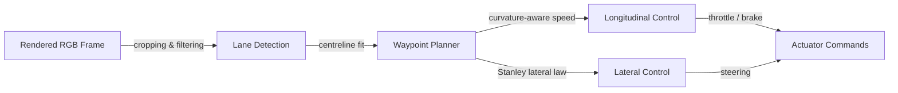

<div align="center">

<h2>Modular Self-Driving Car Pipeline</h2>

[](https://www.python.org/)
[](https://gymnasium.farama.org/environments/box2d/car_racing/)
[](https://deepwiki.com/CagriCatik/Modular-SDC-Pipeline)

</div>

A fully modular perception--planning--control stack for the Gymnasium [`CarRacing-v3`](https://gymnasium.farama.org/environments/box2d/car_racing/) environment. The project emphasises deterministic, explainable algorithms so that tuning and experimentation remain reproducible across machines.



## Highlights

* **Configuration-first** -- every tunable parameter lives in a YAML file so you can iterate on perception thresholds, waypoint smoothing, and controller gains without touching Python code.
* **Typed modular pipeline** -- perception, planning, and control stages expose small, composable interfaces that simplify orchestration and testing.
* **Live observability** -- a Matplotlib dashboard streams lanes, waypoints, velocity, and command histories to speed up debugging sessions.
* **Scientific documentation** -- MkDocs hosts a single technical reference with derivations and tuning guidelines, published automatically via GitHub Actions.

## Repository layout

| Path                           | Description                                                                                    |
| ------------------------------ | ---------------------------------------------------------------------------------------------- |
| `modular_pipeline.py`          | CLI entry point that loads configuration, instantiates modules, and drives the simulator loop. |
| `config.yml`                   | Default configuration consumed by the pipeline. Override with `--config` on the CLI.           |
| `src/pipeline/`                | Core pipeline abstractions, module factories, dashboard implementation, and telemetry helpers. |
| `src/lane_detection.py`        | Gradient-based lane extractor that returns left/right spline coefficients.                     |
| `src/waypoint_prediction.py`   | Waypoint generator and curvature-aware target speed estimation.                                |
| `src/lateral_control.py`       | Stanley controller with damping and reset support.                                             |
| `src/longitudinal_control.py`  | Saturated PID controller for throttle and brake commands.                                      |
| `tests/`                       | Interactive scripts and integration harnesses that leverage the same dashboard utilities.      |
| `docs/`                        | MkDocs content, requirements, and the scientific reference.                                    |
| `.github/workflows/deploy.yml` | GitHub Pages deployment workflow for the documentation site.                                   |

## Getting started

### 1. Create a Python environment

The stack targets Python 3.10+.

```bash
python -m venv .venv
source .venv/bin/activate  # On Windows: .venv\Scripts\activate
pip install -r requirements.txt
```

Optional simulator assets (Gymnasium Box2D) can be installed via the provided PowerShell or Bash helper scripts inside the repository root.

### 2. Run the modular pipeline

```bash
python modular_pipeline.py
```

Command-line flags:

* `--config PATH` -- load an alternative YAML configuration.
* `--score` -- evaluate the leaderboard seeds declared under `evaluation.leaderboard_seeds`.
* `--no_display` -- disable the live dashboard for headless servers.

### 3. Tune via configuration

The configuration file mirrors the pipeline structure:

| Section                     | Notable parameters                                                           |
| --------------------------- | ---------------------------------------------------------------------------- |
| `environment`               | Gymnasium environment ID, render mode, frame stacking, and wrappers.         |
| `runtime`                   | Episode horizon, integration timestep, and random seeds.                     |
| `perception.lane_detection` | Crop bounds, blur kernels, Canny thresholds, and spline smoothing.           |
| `planning`                  | Waypoint count, curvature smoothing weight, and maximum lookahead distance.  |
| `control.lateral`           | Stanley gain, damping term, image-centre alignment, and steering saturation. |
| `control.longitudinal`      | PID gains, integral clamp, feed-forward bias, and throttle/brake bounds.     |
| `monitoring.dashboard`      | Enable flag, history length, Matplotlib style, and figure layout.            |
| `evaluation`                | Episode count, score aggregation strategy, and leaderboard seeds.            |

Create multiple YAML files (e.g. `configs/aggressive.yml`) to experiment with alternative behaviours and supply them through `--config`.

## Live debugging dashboard

The dashboard attaches to any pipeline execution--including the interactive test scripts under `tests/`--and visualises:

* raw RGB frame with detected lane splines and planned centreline waypoints,
* lateral and longitudinal error traces,
* commanded steering, throttle, and brake signals,
* reference versus measured velocity.

To disable the window (for CI or remote sessions), either pass `--no_display` or set `monitoring.dashboard.enabled` to `false` within the configuration file.

## Testing & validation

The project provides multiple executable harnesses that exercise individual modules (`test_lane_detection.py`, `test_lateral_control.py`, etc.) alongside an integration test (`test_pipeline_integration.py`). Run them directly with Python; they automatically adjust `sys.path` so imports resolve without package installation:

```bash
python tests/test_pipeline_integration.py --no_display
```

For static checks you can also compile the pipeline modules:

```bash
python -m compileall src/pipeline
```

## Documentation site

MkDocs (Material theme) renders the documentation found in `docs/`. Install the extra dependencies and launch a development server with hot reloading:

```bash
pip install -r docs/requirements.txt
mkdocs serve
```
