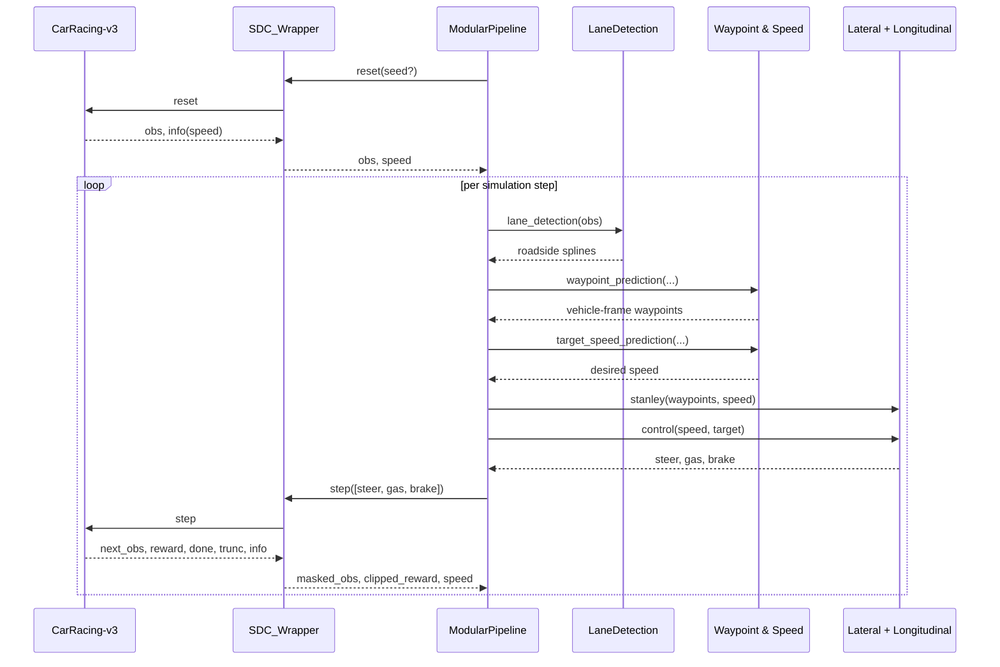

# System Architecture

The pipeline follows a perception → planning → control loop. Each module is
pure-Python and interacts through NumPy arrays, which makes the stack portable
across operating systems and reproducible in CI.

## Runtime orchestration

The `ModularPipeline` class coordinates the environment and the controllers. It
starts by resetting the wrapped Gymnasium environment, extracts the initial
speed from the `info` dictionary, and then iterates until termination or a fixed
horizon is reached.

## Timing and coordinate frames

* **Simulator tick** – CarRacing integrates at 50 Hz (Δt = 0.02 s). The
  longitudinal controller accepts an explicit `dt` argument to match this rate.
* **Image frame** – Lane detection works in cropped image coordinates. Splines
  are evaluated in `[x, y]` pixels with the vehicle origin placed at the bottom
  centre of the crop.
* **Vehicle frame** – Waypoint generation and all control logic use the vehicle
  frame where `x` points forward and `y` points left.

## Failure handling

1. Lane detection retains the previous spline when no reliable peaks are found.
2. Waypoint generation falls back to a straight centreline if splines are
   missing or numerically unstable.
3. Target-speed estimation lower-bounds the command to maintain forward
   progress when curvature cannot be estimated.
4. The longitudinal PID controller clamps its integral term to avoid windup and
   saturates gas/brake commands to the 0–0.8 range required by the simulator.
