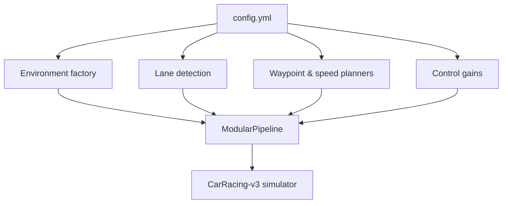

# Configuration Reference

All runtime parameters are defined in `config.yml`. The file is loaded at startup
and determines how the simulator, perception, planning, and control layers are
wired together. Provide an alternate YAML file with `--config` to experiment
with different controller gains or planner strategies without editing code.

```bash
python modular_pipeline.py --config configs/aggressive.yaml --no_display
```

## High-level flow



## Sections

| Path | Description |
|------|-------------|
| `environment` | Gymnasium environment ID, render mode, and wrapper toggles. |
| `runtime` | Episode horizon (`max_steps`) and integration timestep (`timestep_seconds`). |
| `perception.lane_detection` | Crop height, spline smoothing, and gradient thresholds. |
| `planning.waypoints` | Number of waypoints, smoothing beta, and whether to use centreline or smoothed curves. |
| `planning.target_speed` | Curvature-to-speed mapping (`num_waypoints_used`, `max_speed`, `min_speed`, `curvature_gain`). |
| `control.lateral` | Stanley controller gains (`gain_constant`, `damping_constant`). |
| `control.longitudinal` | PID gains, integrator clamp, and actuator saturation. |
| `evaluation` | Default evaluation episode count and leaderboard seeds. |

## Example override

Create a file such as `configs/rainy.yaml` to adapt the controllers to slippery
conditions:

```yaml
environment:
  kwargs:
    render_mode: rgb_array

control:
  lateral:
    gain_constant: 0.02
    damping_constant: 0.02
  longitudinal:
    KP: 0.05
    KI: 0.015
    KD: 0.0
    max_gas: 0.6
    max_brake: 0.9
```

Running `python modular_pipeline.py --config configs/rainy.yaml --no_display`
uses these parameters while leaving the default `config.yml` untouched.
