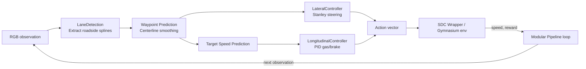

# Modular Self-Driving Car Pipeline

The Modular SDC Pipeline provides a deterministic reference stack for the
CarRacing-v3 environment. Each perception and control stage is implemented as a
standalone component so that researchers can experiment with individual
algorithms without rewriting the rest of the system.

## Why this repository exists

* **Deterministic baseline** – every module is analytical, which makes the
  behaviour debuggable and auditable.
* **Explicit contracts** – clearly defined interfaces between the perception,
  planning, and control stages support incremental upgrades.
* **Simulator ready** – the `modular_pipeline.py` entry point can run in
  headless or interactive mode using Gymnasium's CarRacing simulator.

## End-to-end data flow



## Quick start

```bash
python -m venv .venv
source .venv/bin/activate
pip install -r requirements.txt
python modular_pipeline.py --no_display
```

Use `--score` to reproduce the leaderboard evaluation protocol.

All module parameters are driven by `config.yml`. Supply `--config <path>` to
load an alternative YAML file when experimenting with controller or planner
settings.

## Documentation map

| Topic | Location |
|-------|----------|
| Scientific reference with equations, tuning surfaces, and testing guidance | [`technical_reference.md`](technical_reference.md) |

## Getting help

1. Start with the scientific reference to understand module contracts and control laws.
2. Inspect `modular_pipeline.py` for the command-line interface and configuration wiring.
3. Open an issue when you encounter simulator- or build-specific problems.
